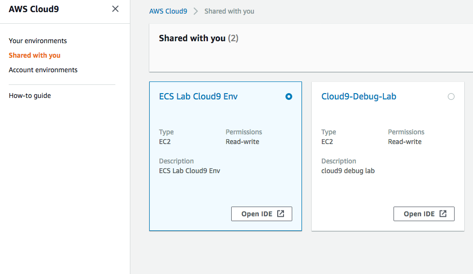
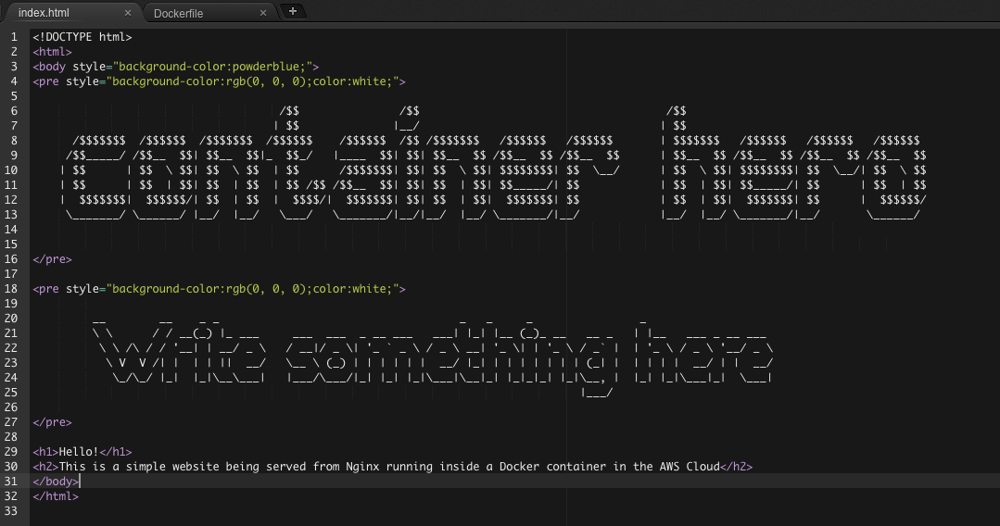
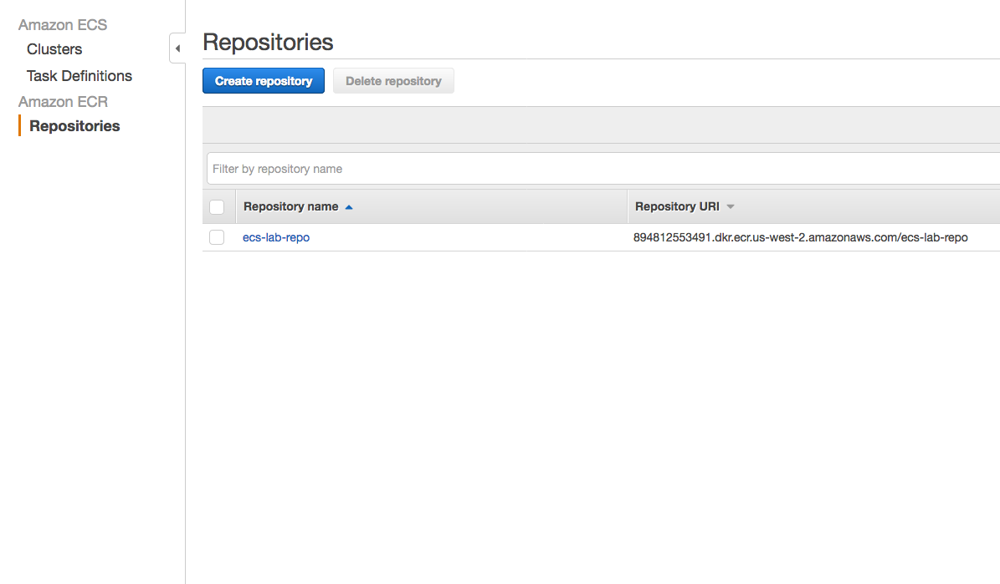
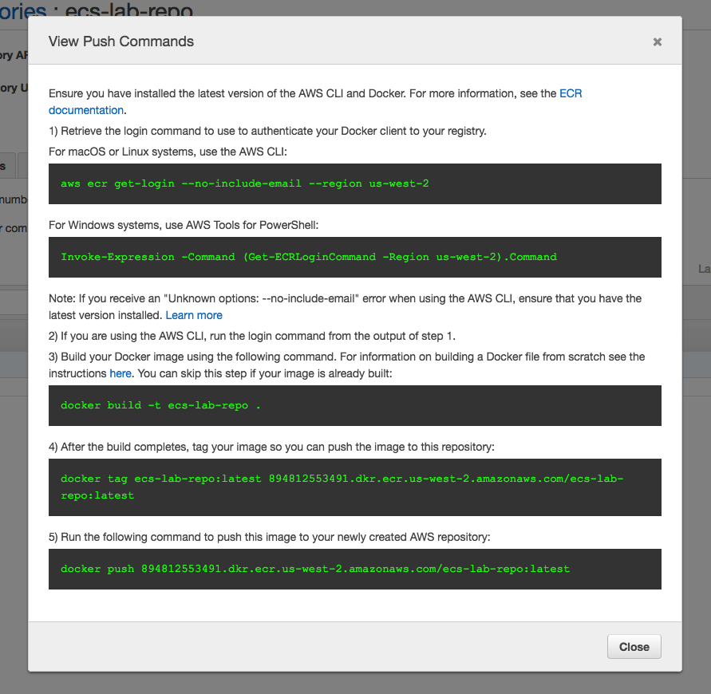
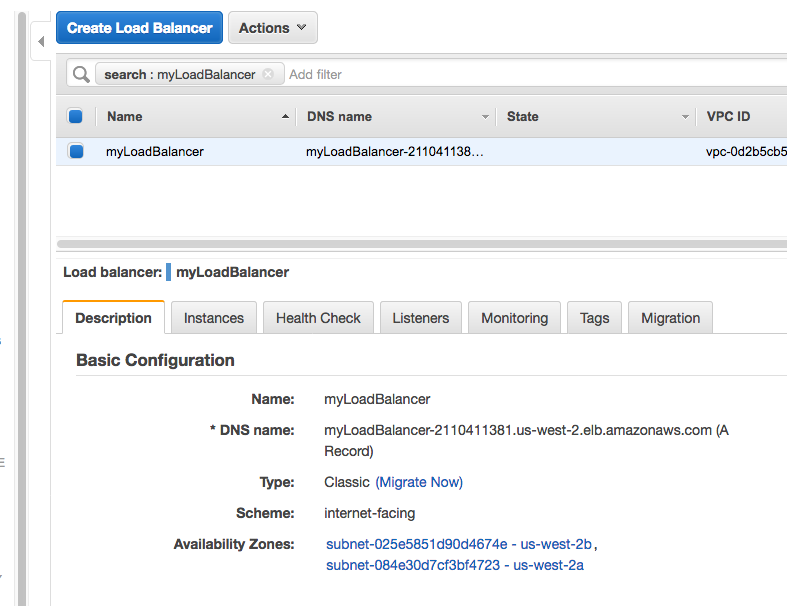

#Let's get started

Search for and Go to **Cloud9** on the AWS Web console

On top right corner - **Switch to Oregon**

On the left hand pane click on **"Shared With You"**

Open the "**ECS Lab Cloud 9 Env**" By clicking on open IDE

**Get set up**

Once Inside Cloud 9 Open the Terminal

cd to the correct folder

\$ cd \~/environment/devlabs2018/

Open the **index.html** file inside the Dev Labs folder and put in
something recognizable

The next person will read what you put in so please be respectful

**Save** your edited HTML File

**\
**

**Build and Run your Docker Container Locally**

Build Image from DockerFile

\$ docker build -t staticsite:1.0 DockerStaticSite-master/

Run Container from freshly built Image

\$ docker run -itd \--name mycontainer \--publish 8080:80 staticsite:1.0

Test if Container is Running

\$ curl http://localhost:8080

If u get a html page as a response, then the container is running
successfully! Well done.**\
**

**Push your container Image to the Cloud**

Now that your containerized application is running locally, let's push
your docker image to a ECR (Elastic Container Repository) repository in
the cloud

Navigate to the ECS (Elastic Container Service) console and Click on
Repositories

Click on "**ecs-lab-repo**"

Click on " **View Push Commands** "

**Go back to cloud9**

**cd into the correct folder**

\$ cd DockerStaticSite-master/

Login to ECR using (The quotes in the command are important)

\$ \`aws ecr get-login \--no-include-email \--region us-west-2\`

**Follow the Push commands 3, 4 & 5 to build and push the modified
image**

\*If facing issues - Make sure you've done step 2

**Once the push is completed your docker image will be pushed to an ECR image repository on AWS**

An ECS cluster is already provisioned for you. The cluster is
currently running a previous version of the same application. You will
now **Deploy** the your new application **Version** to the service

**Update the ECS task definition to use the image that you just Pushed**

Navigate to the **Elastic Container Service** Dashboard.

In the navigation menu on the **left**, click **Task Definitions.**

Select the **simplewebtask**

checkmark **simplewebtask**

Click **Create New Revision**

Scroll to the bottom of the page, then click **Create**

This will create a new version of the Task. Note the Version Number. The
new version will use the latest container image. i.e. the image that you
just pushed.

**Update the ECS Service to deploy the new version of the task**

In the left navigation pane, click **Clusters**.

In the **Clusters** window, click **default \>**.

This is the cluster that your service resides in.

On the **Services** tab, check **webService**

Click **Update** then click on Revision

**Revision:** select the *latest version that you just created*

**Force New Deployment --** Check this box & turn it on

Click **Next Step**

On **Step 2**, click **Next Step**

On **Step 3**, click **Next Step**

On **Step 4**, click **Update Service**

This will deploy a new version of the application.

On the **Launch Status** page, click **View Service**

On the **Service: myService** page, click the **Events** tab.

Wait a few minutes. Monitor the process of draining connections and
stopping tasks till the service reaches a steady state.

You may need to click the **Refresh** button to see the new events.

Once the events says "service webService has reached a steady state."

Click the **Deployments** tab.

Click on **myLoadBalancer**

Paste in the **Load Balancer\'s DNS name** to see the new version of the
app running in the cloud

Congratulations! Your Containerized web application is Now Running in
the cloud

**Lab Setup Steps**

**Get Website Files downloaded into cloud9**

\$ git clone https://github.com/bikrambora/devlabs2018.git

OR

\$ git reset \--hard origin/master

**Run Reset Script**

\$ chmod +x Reset,sh

\$ ./Reset.sh
